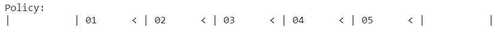
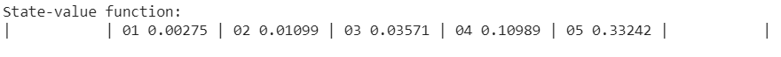
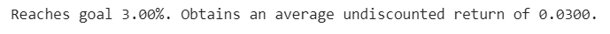
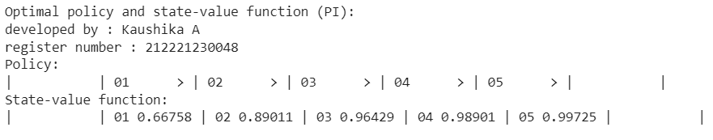
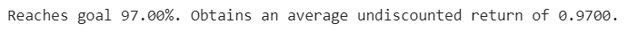

# POLICY ITERATION ALGORITHM

## AIM
To develop a Python program to find the optimal policy for the given MDP using the policy iteration algorithm.

## PROBLEM STATEMENT
The bandit slippery walk problem is a reinforcement learning problem in which an agent must learn to navigate a 7-state environment in order to reach a goal state. The environment is slippery, so the agent has a chance of moving in the opposite direction of the action it takes.

### States
The environment has 7 states:

- Two Terminal States: 
    - G: The goal state  
    - H: A hole state.
- Five Transition states / Non-terminal States including S: The starting state.
### Actions
The agent can take two actions:

- R: Move right.
- L: Move left.

### Transition Probabilities
The transition probabilities for each action are as follows:

- 50% chance that the agent moves in the intended direction.
- 33.33% chance that the agent stays in its current state.
- 16.66% chance that the agent moves in the opposite direction.

For example, if the agent is in state S and takes the "R" action, then there is a 50% chance that it will move to state 4, a 33.33% chance that it will stay in state S, and a 16.66% chance that it will move to state 2.

### Rewards
- The agent receives a reward of +1 for reaching the goal state (G). 
- The agent receives a reward of 0 for all other states.

### Graphical Representation


## POLICY ITERATION ALGORITHM
The algorithm implemented in the policy_iteration is a method used to find the optimal policy in a Markov decision process (MDP). Here's a step-by-step explanation of the algorithm:

1. Initialize the policy **pi**. In this implementation, a random action is chosen for each state s in the MDP **P**. The initial policy is represented by the lambda function **pi=lambda s:{s:a for s,a in enumerate(random_actions)}[s]**, where random_actions is a list of randomly chosen actions for each state.

2. Enter a loop that continues until the policy pi is no longer changing. This is determined by comparing the previous policy **(old_pi)** with the current policy computed in the loop.

3. Store the previous policy as **old_pi** for comparison later.

4. Perform policy evaluation using the function **policy_evaluation**. This step calculates the state-values **(V)** for each state **s** given the current policy **pi**. The state-values represent the expected cumulative rewards starting from state **s** following policy **pi** and discounting future rewards by a factor of **gamma**. The function **policy_evaluation** is called with the arguments **pi**, **P**, **gamma**, and **theta**.

5. Perform policy improvement using the function **policy_improvement**. This step updates the policy **pi** based on the current state-values **V**. The function **policy_improvement** is called with the arguments **V**, **P**, and **gamma**.

6. Check if the policy has converged by comparing the previous policy **old_pi** with the current policy **{s:pi(s) for s in range(len(P))}**. If they are the same for all states **s**, the loop is exited.

7. Return the final state-values **V** and the optimal policy **pi**.

To summarize, policy iteration iteratively improves the policy by alternating between policy evaluation and policy improvement steps until convergence is reached. The algorithm guarantees to find the optimal policy for the given MDP **P** with a discount factor **gamma**.

## POLICY IMPROVEMENT FUNCTION
```py
#developed by : SRIJITH R
#register numeber: 212221240054
```

```py
def policy_improvement(V, P, gamma=1.0):
    Q = np.zeros((len(P), len(P[0])), dtype=np.float64)
    for s in range(len(P)):
        for a in range(len(P[s])):
            for prob, next_state, reward, done in P[s][a]:
                Q[s][a] += prob * (reward + gamma * V[next_state] * (not done))
    new_pi = lambda s: {s: a for s, a in enumerate(np.argmax(Q, axis=1))}[s]
    return new_pi
```

## POLICY ITERATION FUNCTION
```py
def policy_iteration(P, gamma=1.0, theta=1e-10):
    random_actions = np.random.choice(tuple(P[0].keys()), len(P))
    pi = lambda s:{s:a for s,a in enumerate(random_actions)}[s]
    while True:
      old_pi = {s:pi(s) for s in range(len(P))}
      V=policy_evaluation(pi,P,gamma,theta)
      pi=policy_improvement(V,P,gamma)
      if old_pi == {s:pi(s) for s in range(len(P))}:
        break
    return V, pi
```

## OUTPUT:
### Adversarial Policy and its probability success rate:






### Optimal Policy with Gamma = 0.90 and its probability success rate:




## RESULT:

Thus, a Python program is developed to find the optimal policy for the given MDP using the policy iteration algorithm.
